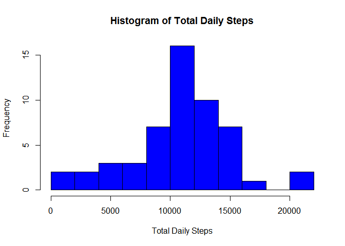
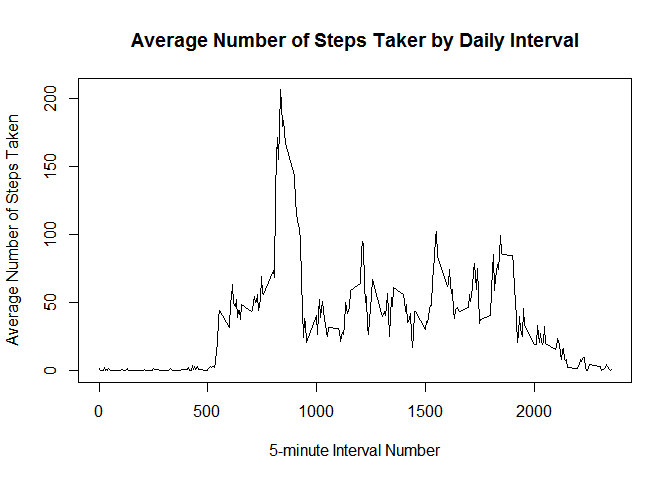
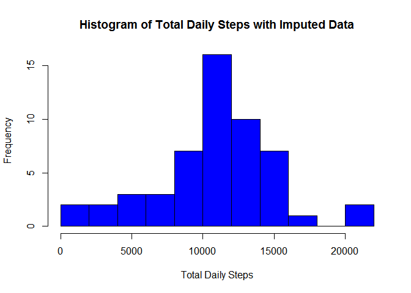
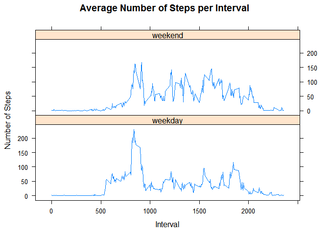

# Reproducible Research: Peer Assessment 1


## Loading and preprocessing the data

```r
activity <- read.csv(unz("activity.zip", "activity.csv"),
                     header=TRUE, sep=",")
```

Data is loaded.

## What is mean total number of steps taken per day?

```r
#Create list of total daily steps
avgDailySteps <- tapply(activity$steps, activity$date, FUN=sum)

#Create Histogram of total daily steps
hist(avgDailySteps,
     col="blue",
     breaks=12,
     xlab="Total Daily Steps",
     ylab="Frequency",
     main="Histogram of Total Daily Steps")
```

<!-- -->

```r
#Calculate the mean of total number of steps taken per day
meanAvgSteps = as.integer(round(mean(avgDailySteps, na.rm=TRUE), 1))

#Calculate the median of total number of steps taken per day
medianAvgSteps = as.integer(median(avgDailySteps, na.rm=TRUE))
```

The mean of the total number of steps taken per day is 10766  
The median of the total number of steps taken per day is 10765  

## What is the average daily activity pattern?

```r
#Create dataframe of average daily steps by internal number
avgIntervalSteps <- data.frame(as.integer(unique(activity$interval)),
                               tapply(activity$steps,
                                      activity$interval,
                                      FUN=mean,
                                      na.rm=TRUE))
names(avgIntervalSteps) <- c("interval", "avgSteps")

#Plot a line graphs of the average steps per 5-minute interval
plot(avgIntervalSteps,
     type="l",
     main="Average Number of Steps Taker by Daily Interval",
     xlab="5-minute Interval Number",
     ylab="Average Number of Steps Taken")
```

<!-- -->

```r
#Find the 5-minute interval that has the maximum number of steps
maxStepsInterval = avgIntervalSteps$interval[which.max(avgIntervalSteps$avgSteps)]
```
The 5-minute interval that contains the highest average number of steps, across all days in the data set, is number 835.  

## Imputing missing values

```r
#Count rows with any NA's in them
rowsWithNA = nrow(activity) - sum(complete.cases(activity))
```

The total number of rows with missing values in the dataset is 2304.  


```r
#Duplicate activity database for storage of imputed steps
actImp <- activity

#Create column with date as POSIX date
actImp$dateTime <- strptime(actImp$date, format="%Y-%m-%d")

#Use previously created avgIntervalSteps as substitue for missing data by interval number
actImp$steps[is.na(actImp$steps)] <- avgIntervalSteps$avgSteps[match(actImp$interval[is.na(actImp$steps)],
                                                                     avgIntervalSteps$interval)]

#Create list of total daily imputed steps
avgDailyImpSteps <- tapply(activity$steps, activity$date, FUN=sum)

#Create Histogram of total daily imputed steps
hist(avgDailyImpSteps,
     col="blue",
     breaks=12,
     xlab="Total Daily Steps",
     ylab="Frequency",
     main="Histogram of Total Daily Steps with Imputed Data")
```

<!-- -->

```r
#Calculate the mean of average Steps
meanAvgImpSteps = as.integer(round(mean(avgDailyImpSteps), 1))

#Calculate the median of average Steps
medianAvgImpSteps = as.integer(median(avgDailyImpSteps))
```

The mean of the total number of steps taken per day is 10766.  
The median of the total number of steps taken per day is 10765.  

These values do not differ from the first part of the assignment when NA's
were ignored. The impact of imputing missing data, using averages, on the
estimates of the total daily number of steps is minimal.

## Are there differences in activity patterns between weekdays and weekends?

```r
#Create list of weekdays and weekend days
weekdayDays = c("Monday", "Tuesday", "Wednesday", "Thursday", "Friday")
weekendDays = c("Saturday", "Sunday")

#Create variable of the day of the week
actImp <- transform(actImp, DayOfWeek = weekdays(dateTime))

#Create Factor for Weekday vs. Weekend
actImp <- transform(actImp,
                    typeOfDay = factor(ifelse(is.element(DayOfWeek,
                                                         weekdayDays),
                                              "weekday",
                                              "weekend")))

#separate Imputed Activity Dataframe by Weekday vs. Weekend
tmpActImpList <- split(actImp, actImp$typeOfDay)
actImpWeekdays <- tmpActImpList[[1]]
actImpWeekends <- tmpActImpList[[2]]
rm(tmpActImpList)

#create Average Interval number of steps for weekday and weekend data
avgIntImpWeekdaySteps <- data.frame(as.integer(unique(actImpWeekdays$interval)),
                                    tapply(actImpWeekdays$steps,
                                           actImpWeekdays$interval,
                                           FUN=mean,
                                           na.rm=TRUE))
names(avgIntImpWeekdaySteps) <- c("interval", "avgSteps")
avgIntImpWeekdaySteps["TypeOfDay"] <- "weekday"

avgIntImpWeekendSteps <- data.frame(as.integer(unique(actImpWeekends$interval)),
                                    tapply(actImpWeekends$steps,
                                           actImpWeekends$interval,
                                           FUN=mean,
                                           na.rm=TRUE))
names(avgIntImpWeekendSteps) <- c("interval", "avgSteps")
avgIntImpWeekendSteps["TypeOfDay"] <- "weekend"

#combmine weekday and weekend data for panel plot
avgIntImpSteps <- rbind(avgIntImpWeekdaySteps, avgIntImpWeekendSteps)
rm(avgIntImpWeekdaySteps, avgIntImpWeekendSteps)
```


#Make panel Plot of weekdays vs. weekend avg. steps per interval

```r
library(lattice)
xyplot(avgSteps~interval | TypeOfDay,
       data=avgIntImpSteps,
       type="l",
       ylab="Number of Steps",
       xlab="Interval",
       main="Average Number of Steps per Interval",
       layout=c(1, 2))
```

<!-- -->
